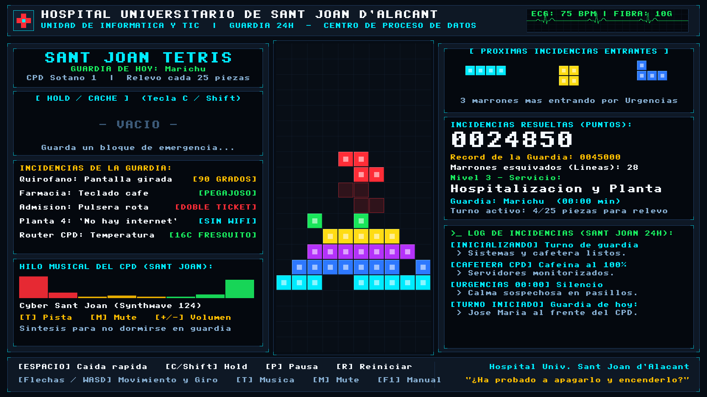
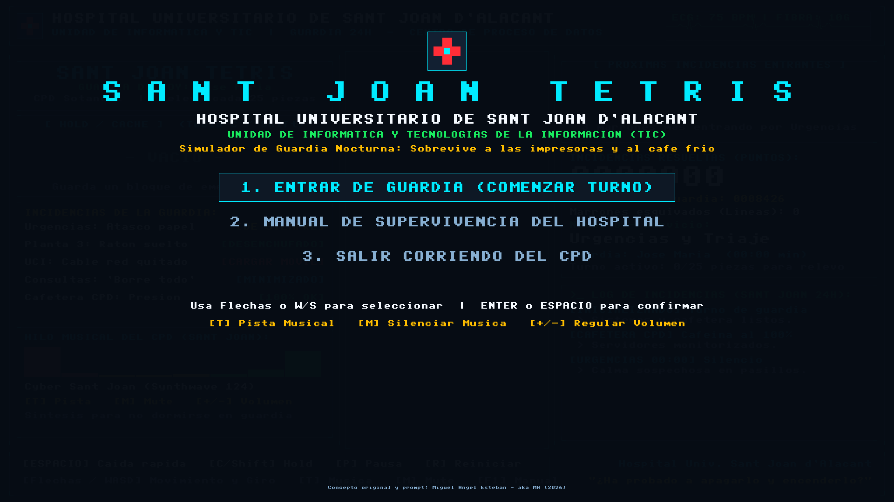
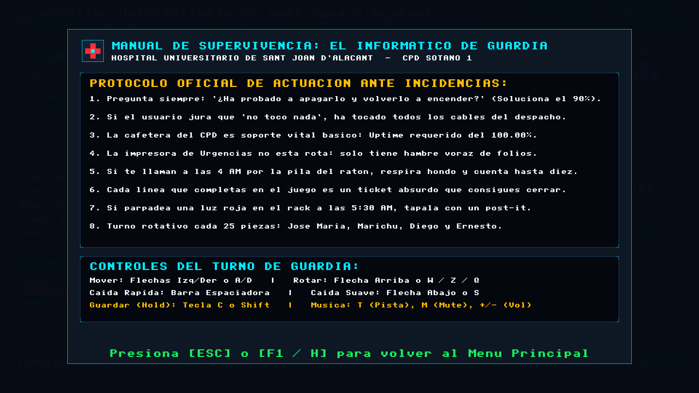
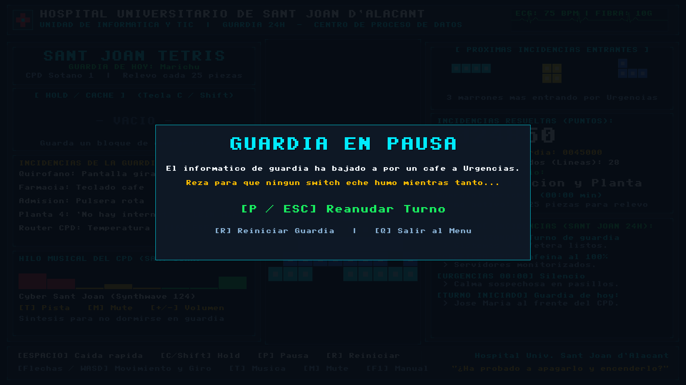

# 🏥 Sant Joan Tetris - Edición Full HD (1920x1080)
### *Unidad de Informática y Tecnologías de la Información (TIC)*
### *Hospital Universitario de Sant Joan d'Alacant*

*(Idea original y prompt: Miguel Ángel Esteban - aka MA - 2026)*

Un juego de Tetris moderno y de alto rendimiento ambientado en el día a día (y la noche a noche) del equipo de **Informáticos de Guardia** del Hospital Universitario de Sant Joan d'Alacant (**Jose María, Marichu, Diego y Ernesto**), optimizado de forma nativa para resolución **Full HD (1920 × 1080)** con tipografías grandes y bloques de 42 px para una lectura descansada y nítida.



---

## 📸 Galería de Capturas

| Menú Principal e Inicio | Turno de Guardia en Vivo (Full HD) |
|:---:|:---:|
|  |  |
| **Manual de Guardia (F1)** | **Pausa de Guardia (Café en Urgencias)** |
|  |  |

---

## 🌟 La Realidad de la Guardia en Sant Joan

En el Hospital de Sant Joan, el equipo de guardia (**Jose María, Marichu, Diego y Ernesto**) vela por los sistemas 24 horas al día. La noche avanza tranquila... hasta que suena el teléfono de guardia a las 03:40 AM:
* La impresora de Urgencias se ha tragado 40 etiquetas de triaje.
* En Planta 3 juran que el ratón "ha muerto solo" (estaba desenchufado tras mover la papelera).
* Alguien en la UCI ha desenchufado el cable de red del switch para poner a cargar el móvil.
* Y en Consultas, el clásico: *"Doctor, ¿ha probado a apagarlo y volverlo a encender?"* obra el milagro una vez más.

En **Sant Joan Tetris**, cada línea que completas es un ticket absurdo que consigues resolver antes de que los médicos tengan que volver al papel y bolígrafo BIC.

---

## 📺 Optimizado para 1920x1080 (Full HD)

* **Cero fuentes diminutas:** Números de puntuación en formato gigante (48 px), títulos de 56 px y textos de servicio en 16–24 px de alta visibilidad.
* **Bloques de 42 px:** El tablero central mide 420 × 840 px, llenando de forma equilibrada la pantalla sin forzar la vista.
* **Paneles amplios:** Dos laterales de 710 px con el terminal de incidencias en vivo, cola de siguientes peticiones, caché y ecualizador.

---

## 🪟 Cómo Jugar en Windows (10 / 11)

1. **Ejecución directa:**
   * Haz doble clic en **`SantJoanTetris.exe`**.
   * No requiere instalación ni configuraciones (`SDL2.dll` ya está incluida en la carpeta).
2. **Edición Web:**
   * También puedes hacer doble clic en **`SantJoanTetris.html`** para abrirlo en Edge o Chrome en pantalla completa.
3. **Paquete ZIP para llevar:**
   * Tienes el archivo **`SantJoanTetris_Windows.zip`** listo para enviar o copiar a cualquier PC.

---

## 🐧 Cómo Jugar en Linux

```bash
./sant_joan_tetris
# o bien:
./run.sh
```

---

## 🍏 Cómo Jugar en Mac (Apple Silicon: M1 / M2 / M3 / M4)

1. **Ejecución directa (.app):**
   * Descomprime **`SantJoanTetris_macOS_Silicon.zip`**.
   * Haz doble clic en **`SantJoanTetris.app`** (incluye icono Retina y librería SDL2 integrada).
   * *Nota Gatekeeper:* La primera vez en macOS, haz clic derecho sobre la app y pulsa **Abrir** (o escribe en Terminal: `xattr -cr SantJoanTetris.app`).
2. **Desde la Terminal:**
   ```bash
   ./run_mac.sh
   # o bien:
   ./sant_joan_tetris_mac
   ```

---

## 🎮 Controles del Turno

| Tecla | Acción |
|---|---|
| <kbd>←</kbd> / <kbd>→</kbd> o <kbd>A</kbd> / <kbd>D</kbd> | Mover paquete de datos a izquierda / derecha |
| <kbd>↑</kbd> o <kbd>W</kbd> | Rotar en sentido horario (CW) |
| <kbd>Z</kbd> o <kbd>Q</kbd> | Rotar en sentido antihorario (CCW) |
| <kbd>↓</kbd> o <kbd>S</kbd> | Caída suave (*Soft Drop*) |
| <kbd>Espacio</kbd> | Caída instantánea (*Hard Drop*) |
| <kbd>C</kbd> o <kbd>Shift</kbd> | Guardar en la **Caché (Hold)** |
| <kbd>F11</kbd> o <kbd>Alt</kbd>+<kbd>Enter</kbd> | Pantalla completa / Maximizar ventana |
| <kbd>T</kbd> | Cambiar tema musical de guardia |
| <kbd>M</kbd> | Silenciar / Activar música |
| <kbd>+</kbd> / <kbd>-</kbd> | Regular volumen general |
| <kbd>P</kbd> o <kbd>Escape</kbd> | Pausa para ir a por café |
| <kbd>R</kbd> | Reiniciar turno de guardia |
| <kbd>F1</kbd> o <kbd>H</kbd> | Manual de supervivencia del informático de guardia |
| <kbd>F12</kbd> | Guardar captura de pantalla en Full HD (`screenshot_*.bmp`) |

---

## 🏆 Récord de Guardia

Las puntuaciones más altas quedan guardadas de forma persistente en `highscore.txt`.
